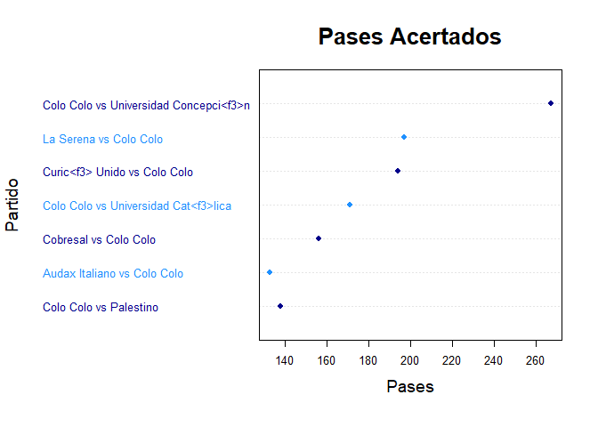
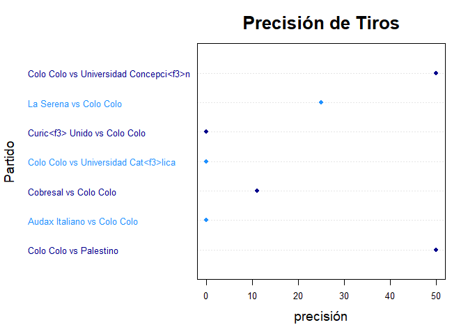

Análisis Exploratorio
================

# Analice el comportamiento de los distintos equipos a través de análisis exploratorios, limpieza de datos y visualización de datos. La base de datos se llama Primer_Tiempo2020.csv

## 1. LIBRERÍAS

``` r
library(quanteda)
```

    ## Warning: package 'quanteda' was built under R version 4.2.1

    ## Package version: 3.2.1
    ## Unicode version: 13.0
    ## ICU version: 69.1

    ## Parallel computing: 12 of 12 threads used.

    ## See https://quanteda.io for tutorials and examples.

``` r
library(dplyr)
```

    ## Warning: package 'dplyr' was built under R version 4.2.1

    ## 
    ## Attaching package: 'dplyr'

    ## The following objects are masked from 'package:stats':
    ## 
    ##     filter, lag

    ## The following objects are masked from 'package:base':
    ## 
    ##     intersect, setdiff, setequal, union

``` r
library(tidyverse)
```

    ## Warning: package 'tidyverse' was built under R version 4.2.1

    ## ── Attaching packages ─────────────────────────────────────── tidyverse 1.3.1 ──

    ## ✔ ggplot2 3.3.6     ✔ purrr   0.3.4
    ## ✔ tibble  3.1.7     ✔ stringr 1.4.0
    ## ✔ tidyr   1.2.0     ✔ forcats 0.5.1
    ## ✔ readr   2.1.2

    ## Warning: package 'ggplot2' was built under R version 4.2.1

    ## Warning: package 'readr' was built under R version 4.2.1

    ## ── Conflicts ────────────────────────────────────────── tidyverse_conflicts() ──
    ## ✖ dplyr::filter() masks stats::filter()
    ## ✖ dplyr::lag()    masks stats::lag()

``` r
library(utf8)
```

    ## Warning: package 'utf8' was built under R version 4.2.1

``` r
library(ggplot2)
```

## 2. BASE DE DATOS

# Se cargan los datos y se revisa con qué tipo de variables se trabajarán.

``` r
datos <- read_csv("C:/Users/cvill/OneDrive/Documentos/GitHub/Data_Mining/Actividades/Actividad 1. Análisis Exploratorio de datos/Primer_Tiempo2020.csv")
```

    ## Rows: 130 Columns: 49
    ## ── Column specification ────────────────────────────────────────────────────────
    ## Delimiter: ","
    ## chr  (6): torneo, equipo, id_partido, partido, fasepartido, tiempo
    ## dbl (42): accuratePass, wonTackle, lostCorners, goalsConceded, saves, ontarg...
    ## lgl  (1): local
    ## 
    ## ℹ Use `spec()` to retrieve the full column specification for this data.
    ## ℹ Specify the column types or set `show_col_types = FALSE` to quiet this message.

``` r
head(datos)
```

    ## # A tibble: 6 × 49
    ##   torneo         equipo id_partido partido fasepartido local tiempo accuratePass
    ##   <chr>          <chr>  <chr>      <chr>   <chr>       <lgl> <chr>         <dbl>
    ## 1 Primera Divis… Uni<f… 6xszsf73j… Univer… Regular Se… FALSE fh              235
    ## 2 Primera Divis… Unive… 6xszsf73j… Univer… Regular Se… TRUE  fh              199
    ## 3 Primera Divis… Evert… e88gat05j… Univer… Regular Se… FALSE fh              157
    ## 4 Primera Divis… Unive… e88gat05j… Univer… Regular Se… TRUE  fh              192
    ## 5 Primera Divis… Curic… 35ijq76er… Univer… Regular Se… FALSE fh              142
    ## 6 Primera Divis… Unive… 35ijq76er… Univer… Regular Se… TRUE  fh              168
    ## # … with 41 more variables: wonTackle <dbl>, lostCorners <dbl>,
    ## #   goalsConceded <dbl>, saves <dbl>, ontargetScoringAtt <dbl>,
    ## #   totalScoringAtt <dbl>, subsMade <dbl>, totalThrows <dbl>,
    ## #   totalYellowCard <dbl>, goalKicks <dbl>, totalPass <dbl>, fkFoulWon <dbl>,
    ## #   totalTackle <dbl>, fkFoulLost <dbl>, possessionPercentage <dbl>,
    ## #   totalClearance <dbl>, formationUsed <dbl>, blockedScoringAtt <dbl>,
    ## #   goalAssist <dbl>, goals <dbl>, totalOffside <dbl>, shotOffTarget <dbl>, …

## 3. VARIABLES

# Se eliminan de la base de datos las variables que no se utilizarán para el análisis.

``` r
datos <- datos[,!(colnames(datos) %in% c("id_partido", "fasepartido", "local", "tiempo","formationUsed", "torneo"))]

head(datos)
```

    ## # A tibble: 6 × 43
    ##   equipo          partido accuratePass wonTackle lostCorners goalsConceded saves
    ##   <chr>           <chr>          <dbl>     <dbl>       <dbl>         <dbl> <dbl>
    ## 1 Uni<f3>n La Ca… Univer…          235         2           3             1     4
    ## 2 Universidad de… Univer…          199         2           0             0     1
    ## 3 Everton         Univer…          157         7           6             0     3
    ## 4 Universidad de… Univer…          192         4           1             0     2
    ## 5 Curic<f3> Unido Univer…          142         6           3             2     2
    ## 6 Universidad de… Univer…          168         8           1             1     2
    ## # … with 36 more variables: ontargetScoringAtt <dbl>, totalScoringAtt <dbl>,
    ## #   subsMade <dbl>, totalThrows <dbl>, totalYellowCard <dbl>, goalKicks <dbl>,
    ## #   totalPass <dbl>, fkFoulWon <dbl>, totalTackle <dbl>, fkFoulLost <dbl>,
    ## #   possessionPercentage <dbl>, totalClearance <dbl>, blockedScoringAtt <dbl>,
    ## #   goalAssist <dbl>, goals <dbl>, totalOffside <dbl>, shotOffTarget <dbl>,
    ## #   wonCorners <dbl>, cornerTaken <dbl>, penaltyConceded <dbl>,
    ## #   penaltyFaced <dbl>, penGoalsConceded <dbl>, penaltyWon <dbl>, …

## 4. SUB DATAFRAMES

# Se crean las bases “Pases” y “Tiros” que contienen información relevante para el campo que quieran ser analizado.

``` r
Pases = datos[,colnames(datos) %in% c("equipo", "partido", "accuratePass", "totalPass", "precision_pases")]
Pases = Pases[order(Pases$precision_pases, decreasing = TRUE),]

head(Pases)
```

    ## # A tibble: 6 × 5
    ##   equipo                  partido         accuratePass totalPass precision_pases
    ##   <chr>                   <chr>                  <dbl>     <dbl>           <dbl>
    ## 1 Audax Italiano          Audax Italiano…          220       246            89.4
    ## 2 Universidad Cat<f3>lica Universidad Ca…          269       304            88.5
    ## 3 Uni<f3>n La Calera      Uni<f3>n La Ca…          252       285            88.4
    ## 4 Deportivo Antofagasta   Deportivo Anto…          253       289            87.5
    ## 5 Uni<f3>n La Calera      Universidad de…          235       271            86.7
    ## 6 Universidad de Chile    Huachipato vs …          202       233            86.7

``` r
Tiros = datos[,colnames(datos) %in% c("equipo", "partido", "goals", "ontargetScoringAtt", "totalScoringAtt", "blockedScoringAtt", "shotOffTarget", "precision_tiros")]
Tiros = Tiros[order(Tiros$goals, decreasing = TRUE),]

head(Tiros)
```

    ## # A tibble: 6 × 8
    ##   equipo         partido ontargetScoring… totalScoringAtt blockedScoringA… goals
    ##   <chr>          <chr>              <dbl>           <dbl>            <dbl> <dbl>
    ## 1 Uni<f3>n Espa… Uni<f3…                4               5                0     3
    ## 2 Universidad d… Univer…                4               7                1     2
    ## 3 Universidad C… Univer…                3               8                2     2
    ## 4 Huachipato     Uni<f3…                2               2                0     2
    ## 5 Audax Italiano Uni<f3…                3               5                1     2
    ## 6 Santiago Wand… Santia…                4               6                1     2
    ## # … with 2 more variables: shotOffTarget <dbl>, precision_tiros <dbl>

## 5. ANÁLISIS DE EQUIPO

# Se seleccionará un equipo de la base de datos para analizar el rendimiento de pases y tiros registrados.

``` r
equipo <- unique(datos['equipo'])


equipo1 <- "Colo Colo"

equipo
```

    ## # A tibble: 18 × 1
    ##    equipo                   
    ##    <chr>                    
    ##  1 Uni<f3>n La Calera       
    ##  2 Universidad de Chile     
    ##  3 Everton                  
    ##  4 Curic<f3> Unido          
    ##  5 Coquimbo Unido           
    ##  6 Santiago Wanderers       
    ##  7 Universidad Concepci<f3>n
    ##  8 Cobresal                 
    ##  9 O'Higgins                
    ## 10 Universidad Cat<f3>lica  
    ## 11 Deportes Iquique         
    ## 12 Uni<f3>n Espa<f1>ola     
    ## 13 La Serena                
    ## 14 Palestino                
    ## 15 Huachipato               
    ## 16 Audax Italiano           
    ## 17 Deportivo Antofagasta    
    ## 18 Colo Colo

``` r
equipo1
```

    ## [1] "Colo Colo"

``` r
equipo_data <- filter(datos, equipo == equipo1)
equipo_Pases <- filter(Pases, equipo == equipo1)
equipo_Tiros <- filter(Tiros, equipo == equipo1)
```

``` r
#Se elimina de la base la columna "equipo"
equipo_Pases <- equipo_Pases[,!(colnames(equipo_Pases) %in% c("equipo"))] 

#Se añade el promedio de pases a la base de Colo Colo
Promedios_Pases <- c("Promedio Pases",mean(equipo_Pases$accuratePass),mean(equipo_Pases$totalPass),mean(equipo_Pases$precision_pases))
equipo_Pases <- rbind(equipo_Pases, Promedios_Pases)

#Se añade el máximo de pases a la base de Colo Colo
Max_Pases <- c("Max Pases",max(equipo_Pases$accuratePass),max(equipo_Pases$totalPass),max(equipo_Pases$precision_pases))
equipo_Pases <- rbind(equipo_Pases, Max_Pases)

#Se añade el mínimo de pases a la base de Colo Colo
Min_Pases <- c("Min Pases",min(equipo_Pases$accuratePass),min(equipo_Pases$totalPass),min(equipo_Pases$precision_pases))
equipo_Pases <- rbind(equipo_Pases, Min_Pases)

head(equipo_Pases)
```

    ## # A tibble: 6 × 4
    ##   partido                                accuratePass totalPass precision_pases 
    ##   <chr>                                  <chr>        <chr>     <chr>           
    ## 1 Colo Colo vs Universidad Concepci<f3>n 231          267       86.5168539325843
    ## 2 Colo Colo vs Universidad Cat<f3>lica   144          171       84.2105263157895
    ## 3 La Serena vs Colo Colo                 162          197       82.2335025380711
    ## 4 Audax Italiano vs Colo Colo            107          133       80.4511278195489
    ## 5 Curic<f3> Unido vs Colo Colo           148          194       76.2886597938144
    ## 6 Cobresal vs Colo Colo                  116          156       74.3589743589744

``` r
#Se elimina de la base la columna "equipo"
equipo_Tiros <- equipo_Tiros[,!(colnames(equipo_Tiros) %in% c("equipo"))] 

#Se añade el promedio de precisión de tiros a la base
Promedios_Tiros <- c("Promedio Pases",mean(equipo_Tiros$totalScoringAtt),mean(equipo_Tiros$goals),mean(equipo_Tiros$precision_tiros))
equipo_Tiros <- rbind(equipo_Tiros, Promedios_Tiros)
```

    ## Warning in rbind(deparse.level, ...): number of columns of result, 7, is not a
    ## multiple of vector length 4 of arg 2

``` r
#Se añade el máximo de pases a la base
Max_Tiros <- c("Max Pases",max(equipo_Tiros$totalScoringAtt),max(equipo_Tiros$goals),max(equipo_Tiros$precision_tiros))
equipo_Tiros <- rbind(equipo_Tiros, Max_Tiros)
```

    ## Warning in rbind(deparse.level, ...): number of columns of result, 7, is not a
    ## multiple of vector length 4 of arg 2

``` r
#Se añade el mínimo de pases a la base
Min_Tiros <- c("Min Pases",min(equipo_Tiros$totalScoringAtt),min(equipo_Tiros$goals),min(equipo_Tiros$precision_tiros))
equipo_Tiros <- rbind(equipo_Tiros, Min_Tiros)
```

    ## Warning in rbind(deparse.level, ...): number of columns of result, 7, is not a
    ## multiple of vector length 4 of arg 2

``` r
equipo_Tiros
```

    ## # A tibble: 10 × 7
    ##    partido ontargetScoring… totalScoringAtt blockedScoringA… goals shotOffTarget
    ##    <chr>   <chr>            <chr>           <chr>            <chr> <chr>        
    ##  1 Colo C… 4                10              2                2     4            
    ##  2 Colo C… 1                3               1                1     1            
    ##  3 La Ser… 1                4               1                0     2            
    ##  4 Curic<… 0                0               0                0     0            
    ##  5 Colo C… 0                6               2                0     4            
    ##  6 Cobres… 1                9               4                0     4            
    ##  7 Audax … 0                9               4                0     5            
    ##  8 Promed… 5.85714285714286 0.428571428571… 19.4444444444444 Prom… 5.8571428571…
    ##  9 Max Pa… 9                Promedio Pases  50               Max … 9            
    ## 10 Min Pa… 0                0               0                Min … 0            
    ## # … with 1 more variable: precision_tiros <chr>

## 6. GRÁFICOS DE RENDIMIENTO

# Se visualiza el comportamiento de los pases y tiros comparandolos con la precisión que obtuvieron en base a los partidos jugados.

``` r
equipo_data_Pases <- equipo_data[order(equipo_data$accuratePass, decreasing = FALSE),]

dotchart(equipo_data_Pases$totalPass, labels = utf8_encode(equipo_data_Pases$partido), main="Pases Acertados", pch = 16, col=c("darkblue","dodgerblue"),lcolor="gray90", cex=0.8, xlab = "Pases", ylab = "Partido", cex.main=2,cex.lab=1.5)
```

<!-- -->

``` r
equipo_data_Tiro <- equipo_data[order(equipo_data$accuratePass, decreasing = FALSE),]

dotchart(equipo_data_Tiro$precision_tiros, labels = utf8_encode(equipo_data_Tiro$partido), main="Precisión de Tiros", pch = 16, col=c("darkblue","dodgerblue"),lcolor="gray90", cex=0.8, xlab = "precisión", ylab = "Partido", cex.main=2,cex.lab=1.5)
```

<!-- -->
