Actividad 2. Análisis de Outliers
================

# De la base de datos de Pokemon, realice un análisis de Outliers con algunas de las variables numéricas y concluir una relación a partir de los resultados obtenidos.

## 1. LIBRERÍAS

``` r
library(dplyr)
```

    ## Warning: package 'dplyr' was built under R version 4.2.1

    ## 
    ## Attaching package: 'dplyr'

    ## The following objects are masked from 'package:stats':
    ## 
    ##     filter, lag

    ## The following objects are masked from 'package:base':
    ## 
    ##     intersect, setdiff, setequal, union

## 2. BASE DE DATOS

``` r
Pokedex <- read.csv("C:/Users/cvill/OneDrive/Documentos/GitHub/Data_Mining/Actividades/Actividad 2. Análisis de Outliers/Pokemon.csv")
No_Legendarios <- filter(Pokedex, Legendary == "False")
Legendarios <- filter(Pokedex, Legendary == "True")

head(Pokedex)
```

    ##   X.                  Name Type.1 Type.2 Total HP Attack Defense Sp..Atk
    ## 1  1             Bulbasaur  Grass Poison   318 45     49      49      65
    ## 2  2               Ivysaur  Grass Poison   405 60     62      63      80
    ## 3  3              Venusaur  Grass Poison   525 80     82      83     100
    ## 4  3 VenusaurMega Venusaur  Grass Poison   625 80    100     123     122
    ## 5  4            Charmander   Fire          309 39     52      43      60
    ## 6  5            Charmeleon   Fire          405 58     64      58      80
    ##   Sp..Def Speed Generation Legendary
    ## 1      65    45          1     False
    ## 2      80    60          1     False
    ## 3     100    80          1     False
    ## 4     120    80          1     False
    ## 5      50    65          1     False
    ## 6      65    80          1     False

## 3. BOXPLOT

``` r
#Permite trabajar con el dataframe sin hacer referencias a este.
attach(Pokedex)

#Se proyectan los BOXPLOT en base a una variable numérica, siendo categorizada por la variable "Generation".

boxplot(HP ~ Generation, col = c("Red3","Green3","Blue3","Yellow3","Orange3","Pink3"))
```

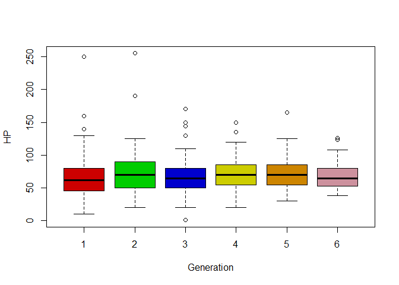<!-- -->

``` r
boxplot(Attack ~ Generation, col = c("Red3","Green3","Blue3","Yellow3","Orange3","Pink3"))
```

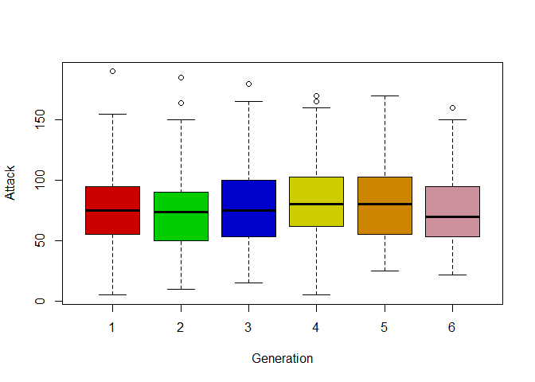<!-- -->

``` r
boxplot(Defense ~ Generation, col = c("Red3","Green3","Blue3","Yellow3","Orange3","Pink3"))
```

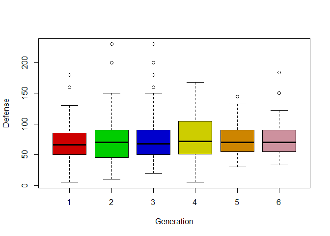<!-- -->

``` r
boxplot(Sp..Atk ~ Generation, col = c("Red3","Green3","Blue3","Yellow3","Orange3","Pink3"))
```

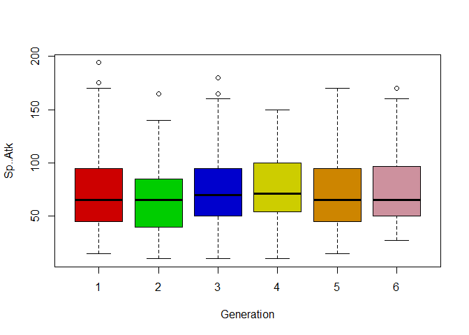<!-- -->

``` r
boxplot(Sp..Def ~ Generation, col = c("Red3","Green3","Blue3","Yellow3","Orange3","Pink3"))
```

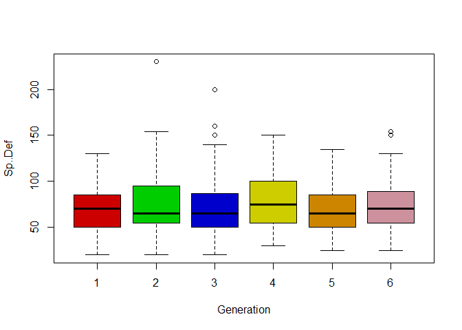<!-- -->

``` r
boxplot(Speed ~ Generation, col = c("Red3","Green3","Blue3","Yellow3","Orange3","Pink3"))
```

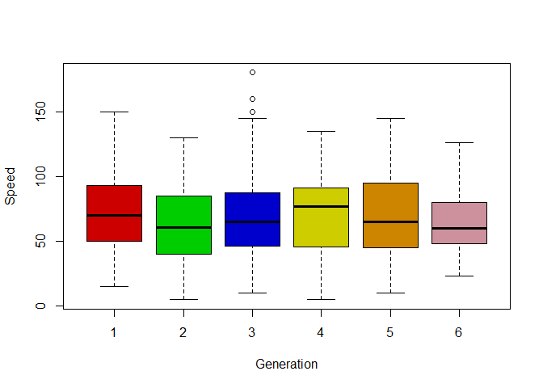<!-- -->

``` r
boxplot(Total ~ Generation, col = c("Red3","Green3","Blue3","Yellow3","Orange3","Pink3"))
```

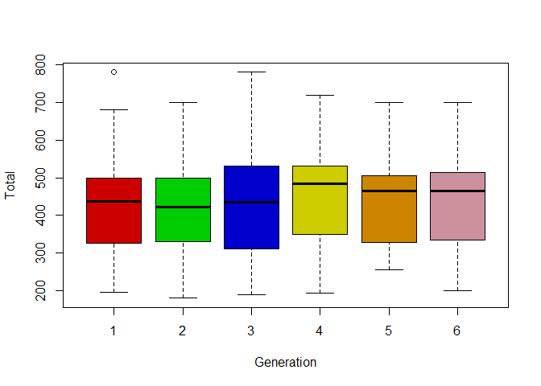<!-- -->

``` r
attach(Legendarios)
```

    ## The following objects are masked from Pokedex:
    ## 
    ##     Attack, Defense, Generation, HP, Legendary, Name, Sp..Atk, Sp..Def,
    ##     Speed, Total, Type.1, Type.2, X.

``` r
boxplot(HP ~ Generation, col = c("Red3","Green3","Blue3","Yellow3","Orange3","Pink3"))
```

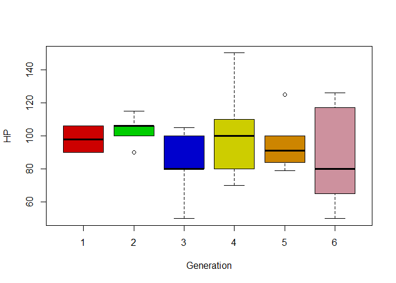<!-- -->

``` r
boxplot(Attack ~ Generation, col = c("Red3","Green3","Blue3","Yellow3","Orange3","Pink3"))
```

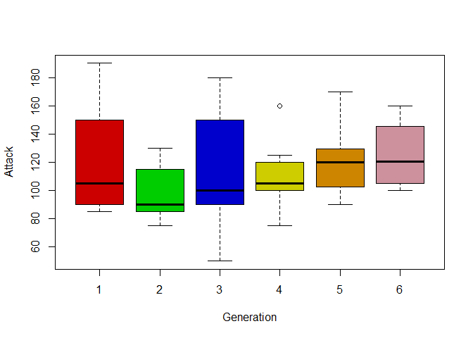<!-- -->

``` r
boxplot(Defense ~ Generation, col = c("Red3","Green3","Blue3","Yellow3","Orange3","Pink3"))
```

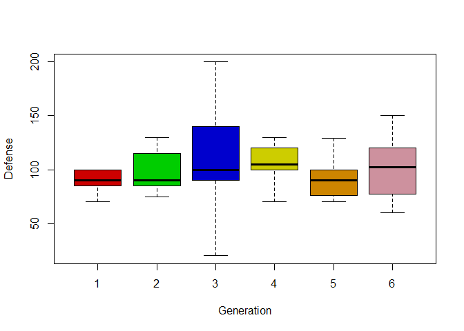<!-- -->

``` r
boxplot(Sp..Atk ~ Generation, col = c("Red3","Green3","Blue3","Yellow3","Orange3","Pink3"))
```

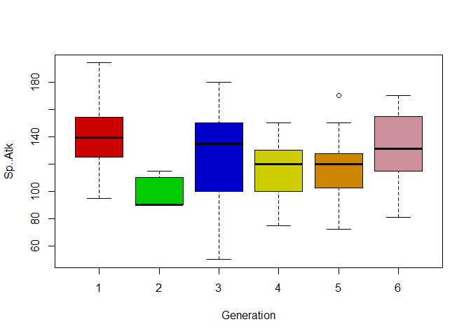<!-- -->

``` r
boxplot(Sp..Def ~ Generation, col = c("Red3","Green3","Blue3","Yellow3","Orange3","Pink3"))
```

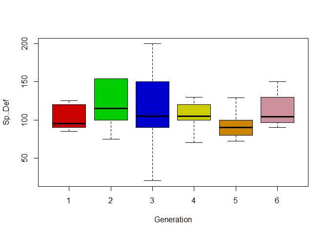<!-- -->

``` r
boxplot(Speed ~ Generation, col = c("Red3","Green3","Blue3","Yellow3","Orange3","Pink3"))
```

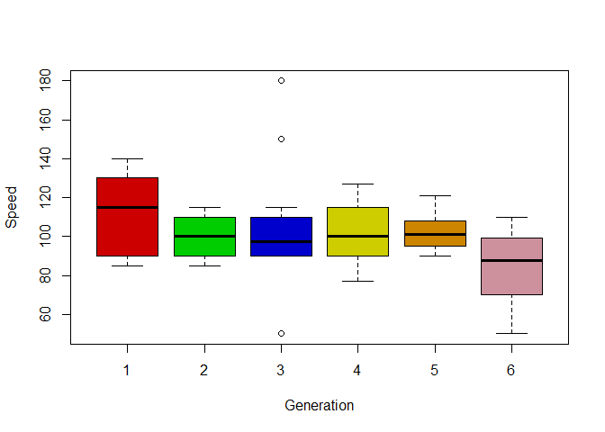<!-- -->

``` r
boxplot(Total ~ Generation, col = c("Red3","Green3","Blue3","Yellow3","Orange3","Pink3"))
```

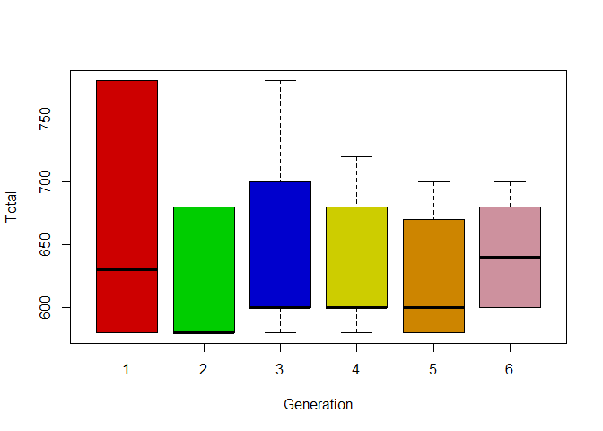<!-- -->

``` r
attach(No_Legendarios)
```

    ## The following objects are masked from Legendarios:
    ## 
    ##     Attack, Defense, Generation, HP, Legendary, Name, Sp..Atk, Sp..Def,
    ##     Speed, Total, Type.1, Type.2, X.

    ## The following objects are masked from Pokedex:
    ## 
    ##     Attack, Defense, Generation, HP, Legendary, Name, Sp..Atk, Sp..Def,
    ##     Speed, Total, Type.1, Type.2, X.

``` r
boxplot(HP ~ Generation, col = c("Red3","Green3","Blue3","Yellow3","Orange3","Pink3"))
```

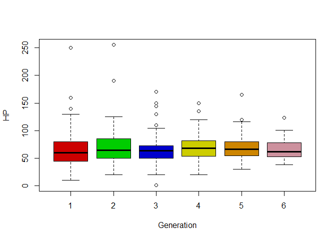<!-- -->

``` r
boxplot(Attack ~ Generation, col = c("Red3","Green3","Blue3","Yellow3","Orange3","Pink3"))
```

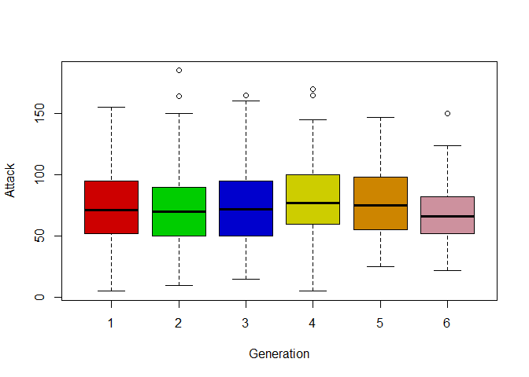<!-- -->

``` r
boxplot(Defense ~ Generation, col = c("Red3","Green3","Blue3","Yellow3","Orange3","Pink3"))
```

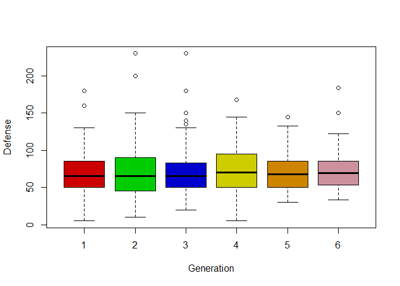<!-- -->

``` r
boxplot(Sp..Atk ~ Generation, col = c("Red3","Green3","Blue3","Yellow3","Orange3","Pink3"))
```

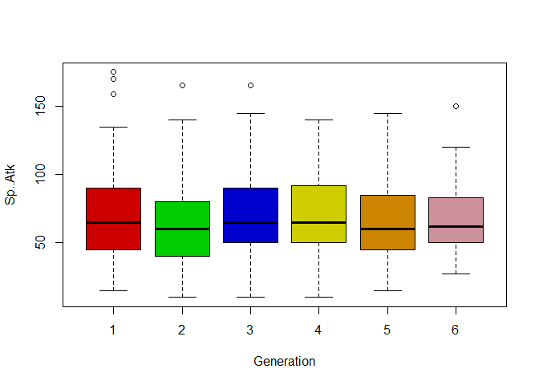<!-- -->

``` r
boxplot(Sp..Def ~ Generation, col = c("Red3","Green3","Blue3","Yellow3","Orange3","Pink3"))
```

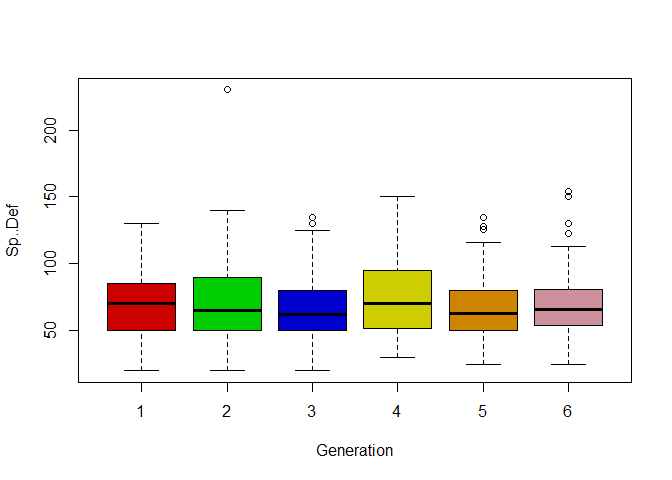<!-- -->

``` r
boxplot(Speed ~ Generation, col = c("Red3","Green3","Blue3","Yellow3","Orange3","Pink3"))
```

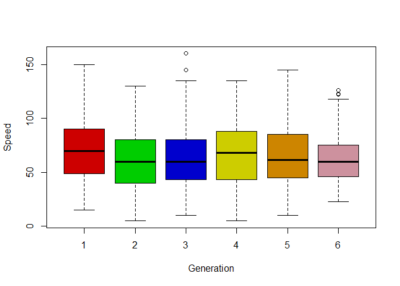<!-- -->

``` r
boxplot(Total ~ Generation, col = c("Red3","Green3","Blue3","Yellow3","Orange3","Pink3"))
```

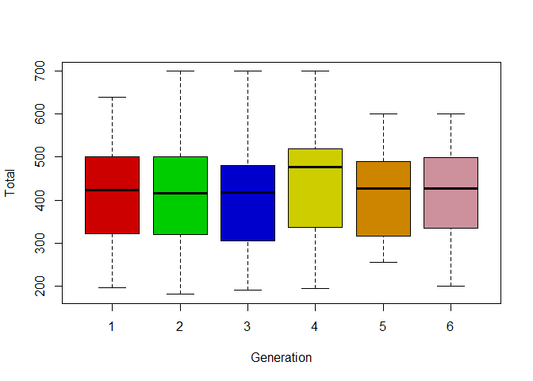<!-- -->

``` r
#Se selecciona el tipo del pokemon y que no sea legendario
NL_Tipo <- filter(Pokedex, Type.1 == "Fire", Legendary == "False")

attach(NL_Tipo)
```

    ## The following objects are masked from No_Legendarios:
    ## 
    ##     Attack, Defense, Generation, HP, Legendary, Name, Sp..Atk, Sp..Def,
    ##     Speed, Total, Type.1, Type.2, X.

    ## The following objects are masked from Legendarios:
    ## 
    ##     Attack, Defense, Generation, HP, Legendary, Name, Sp..Atk, Sp..Def,
    ##     Speed, Total, Type.1, Type.2, X.

    ## The following objects are masked from Pokedex:
    ## 
    ##     Attack, Defense, Generation, HP, Legendary, Name, Sp..Atk, Sp..Def,
    ##     Speed, Total, Type.1, Type.2, X.

``` r
boxplot(HP ~ Generation, col = c("Red3","Green3","Blue3","Yellow3","Orange3","Pink3"))
```

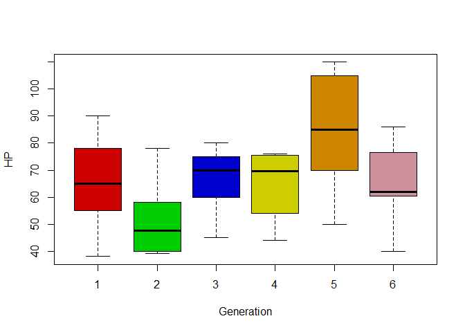<!-- -->

``` r
boxplot(Attack ~ Generation, col = c("Red3","Green3","Blue3","Yellow3","Orange3","Pink3"))
```

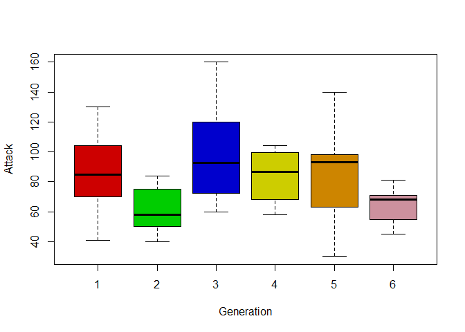<!-- -->

``` r
boxplot(Defense ~ Generation, col = c("Red3","Green3","Blue3","Yellow3","Orange3","Pink3"))
```

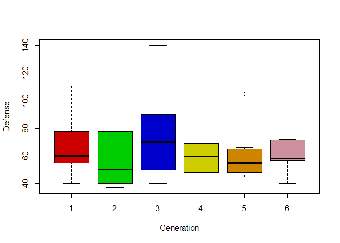<!-- -->

``` r
boxplot(Sp..Atk ~ Generation, col = c("Red3","Green3","Blue3","Yellow3","Orange3","Pink3"))
```

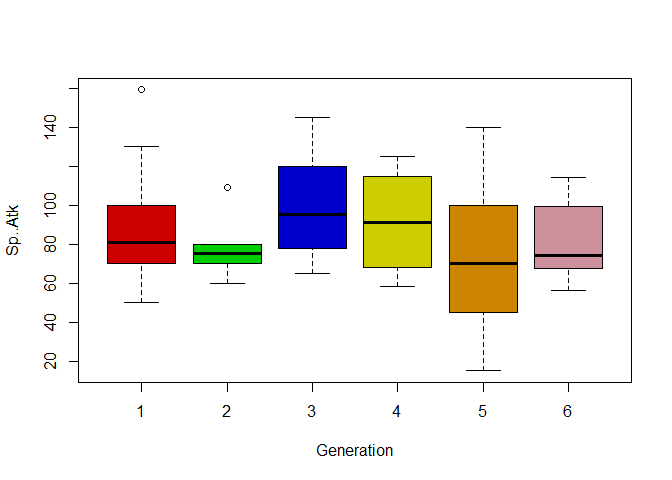<!-- -->

``` r
boxplot(Sp..Def ~ Generation, col = c("Red3","Green3","Blue3","Yellow3","Orange3","Pink3"))
```

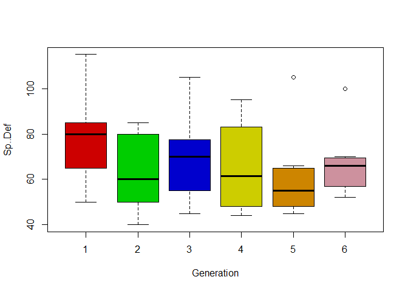<!-- -->

``` r
boxplot(Speed ~ Generation, col = c("Red3","Green3","Blue3","Yellow3","Orange3","Pink3"))
```

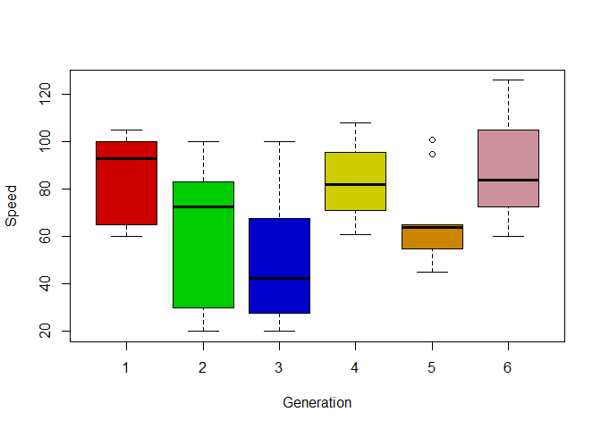<!-- -->

``` r
boxplot(Total ~ Generation, col = c("Red3","Green3","Blue3","Yellow3","Orange3","Pink3"))
```

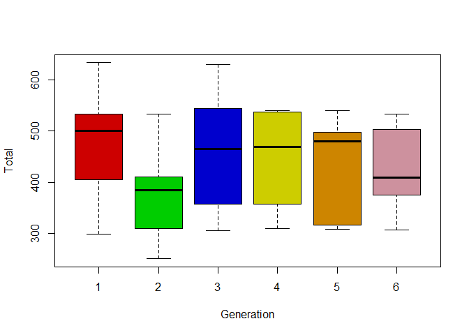<!-- -->

``` r
#Tamaño de la muestra
length(NL_Tipo$Type.1)
```

    ## [1] 47
